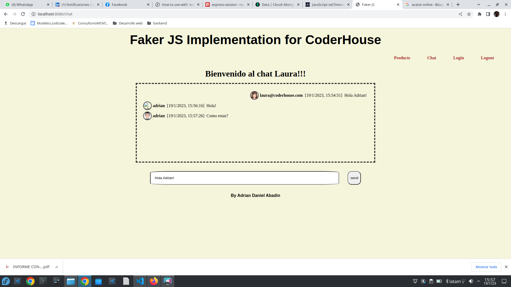

#**Sessions File Storage Feat**

This backend contains two features, the first one is a fake products api with a static view builded through handlebars. And the other Feat is a socket io basic chat with persistance.
When socket connects it retrives data from mongo atlas database and pushes it to the front in an array of objects that represents the menssage.
Then the front paints the dom with the data pushed by the back.
it uses the same function for painting the persistance data and the following chat messages produced.

### INSTALL:

```bash
npm install
```

### EXECUTION:

```bash
npm start
npm run test
```

### DEPENDENCES:

1. EXPRESS
2. MORGAN
3. VITEST
4. EXPRESS-HANDLEBARS
5. FAKER
6. COLORS
7. MONGOOSE
8. SOCKET IO
9. Express-Session
10. Session-File-Storage

### STATIC VIEW:



